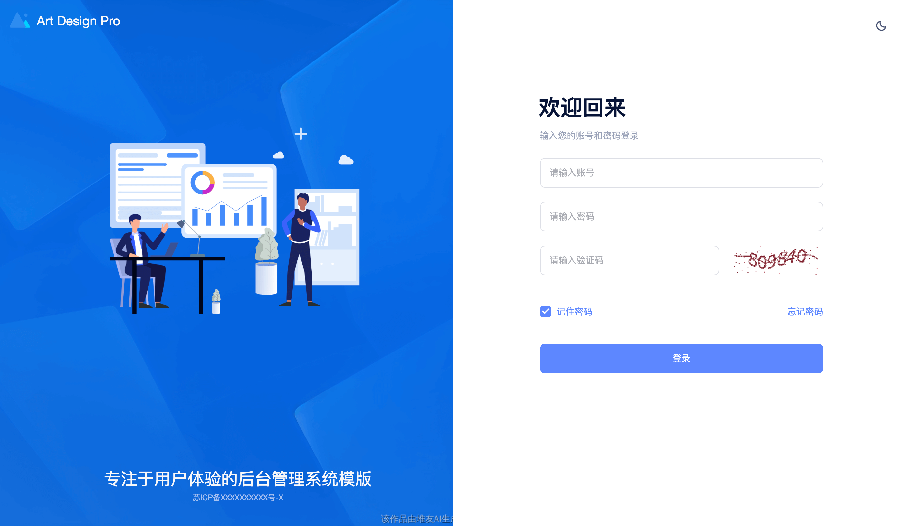
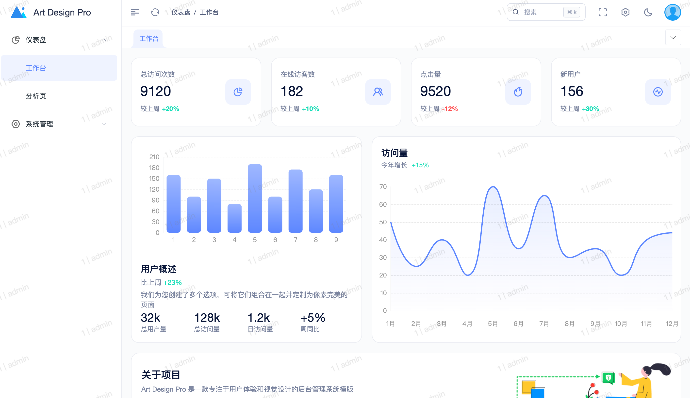
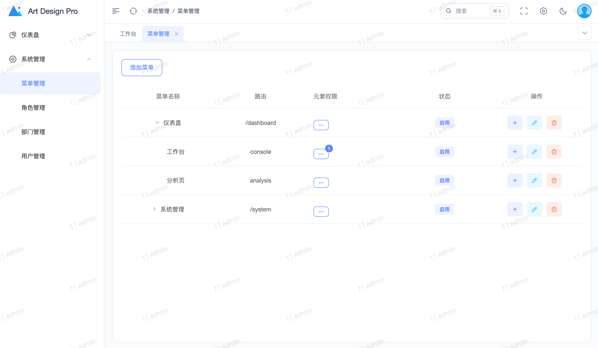
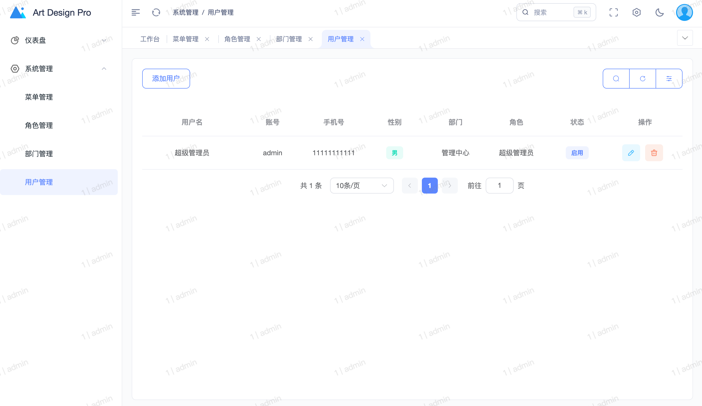
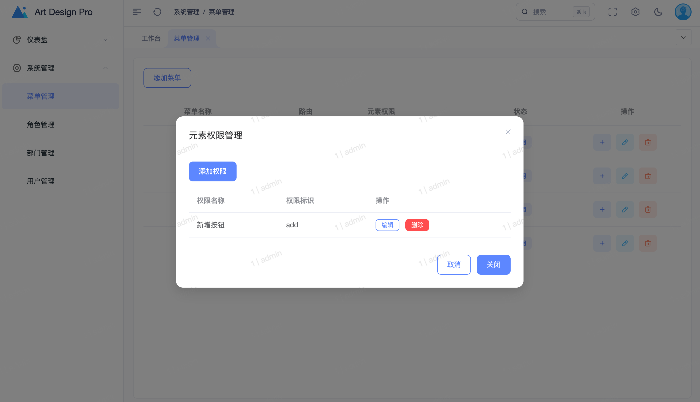
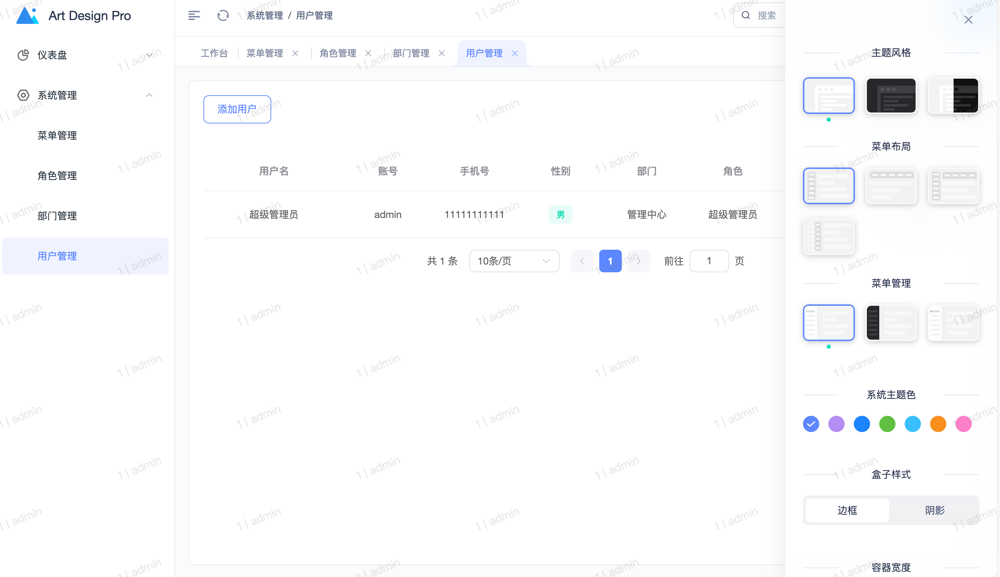
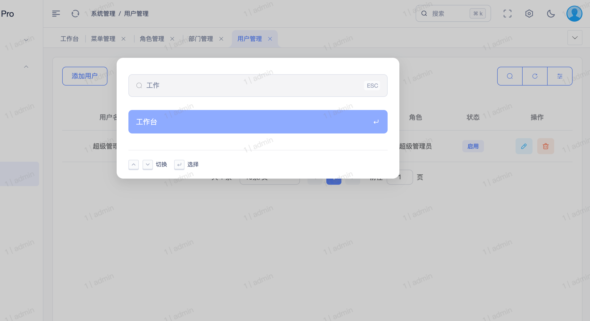
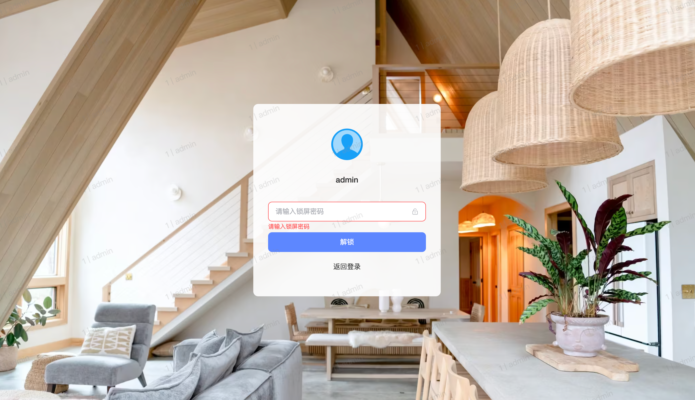
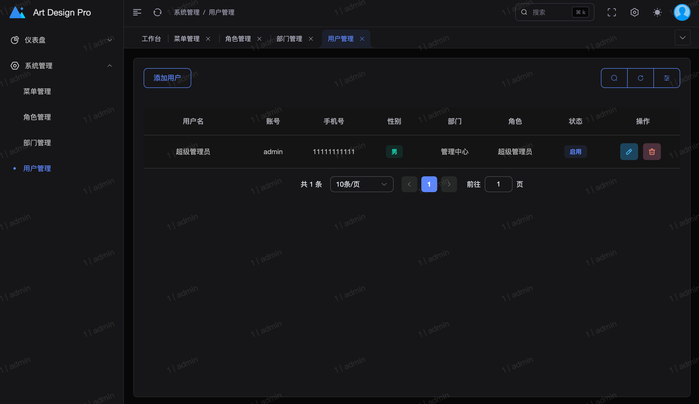

# 关于

本项目 fork 自 [art-design-pro](https://github.com/Daymychen/art-design-pro) 因原项目是纯前端, 无法做到取之即用, 所以本项目将其改造为一个基础的的前后端分离项目。

本项目只具备基本的用户和菜单权限管理功能。程序员需要在此基础上进行其他业务需求的开发, 当然与原项目相比, 不用适配基础的管理功能, 节省一定的工作量.

相比于原项目，本项目做了如下改动：

1. 对接后端 api
2. 去除多余的展示页面
3. 去除英文切换
4. 去除多余的依赖
5. 用户登录滑动验证码改为图形验证码
6. 去除用户注册
7. 增加水印(`{用户id | 用户账号}`), 且无法关闭
8. 更符合直觉的菜单和权限管理
9. 去除忘记密码流程(通过二维码联系管理员进行修改)
10. 去除用户头像自定义功能
11. 去除用户邮箱
12. 系统 logo 修改为使用 svg 静态资源
13. 修复原项目在去除其他标签后, 本标签页的 query 参数丢失的问题

## 项目特点

- 项目的95%代码由 `github copilot` 辅助编写

## TODO

- API层权限管制
- 文档

## 版本

目前同步 [art-design-pro](https://github.com/Daymychen/art-design-pro) 的版本(commitID)为 `b86948fbe4b0bcff6e1ec5acb54e1287eab5a7f8`

## 后端代码

[art-design-pro-edge-go-server](https://github.com/ChnMig/art-design-pro-edge-go-server)

技术栈: `Golang` `Gin` `Gorm` `PostgreSQL` `Redis`

## QA

### 更新频率

在原项目更新时, 本人会尽快同步更新, 但不保证能及时更新。如果是已经精简的页面和逻辑, 本人不会进行同步更新。

### 为什么不做初始化界面

我们假设用户是一个具有开发经验的人，所以我们不会提供一个初始化界面。我们认为用户会通过阅读文档来了解如何使用我们的工具。

## 使用方式

### 安装依赖

> 推荐使用 pnpm

```bash
pnpm install
```

### 调试项目

```bash
pnpm run dev
```

### 关键配置

> 上线之前一定要看

- 后端地址配置在 `.env` `.env.development` `.env.production` 的 `VITE_API_URL` 变量中
- 联系管理员的二维码在 `src/assets/images/qrcode.png` 中, 项目默认的 qrcode 指向本项目地址, 上线前务必修改
- 系统名称在 `src/config/env` 中的 `name` 变量中
- 系统 icon 在 `src/assets/img/favicon.ico` 中
- 系统 logo 在 `src/assets/img/logo.svg` 中

## 截图

> 更多截图可以看 [art-design-pro](https://github.com/Daymychen/art-design-pro)

### 登录



### 首页



### 菜单管理



### 用户管理



### 权限管理



### 设置组件



### 搜索组件



### 锁屏组件



### 黑夜模式


